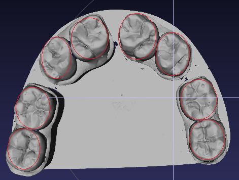

# Площадь зуба

Автор: Чайка Зилия Салуатовна, Уральский Государственный Медицинский Университет, г. Екатеринбург

## Постановка

Требуется создать программу по вычислению площади жевательной поверхности зуба. 
Программа должна позволять специалисту задавать эту поверхность, и выводить значения
- площади поверхности
- площадить проекции поверхности на плоскость XY.

Пояснить термин "жевательная поверхность" призвана картинка:

## Исходные данные
https://yadi.sk/d/eVIEKyuM3NBnoV
